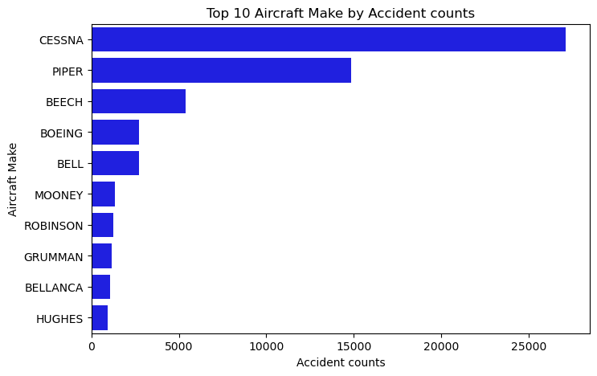
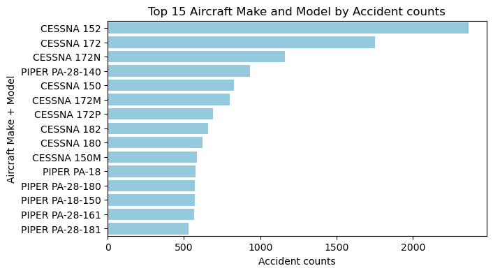
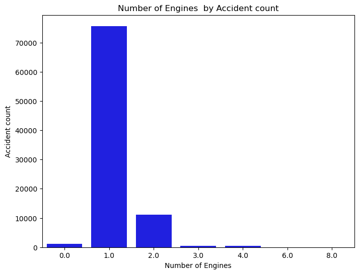

# AIRCRAFT RISK ANALYSIS
***

## OVERVIEW
This project analyzes aviation accidents from the National Transportation Safety Board(NTSB), covering incidents from 1962 to 2023. The goal is to identify low risk aircrafts that the company can consider for purchase as it ventures into commercial and private enterprise by cleaning, sorting, grouping, aggregating data, we extract insight for strategic decision making of aircraft acquisiotion.

## BUSINESS PROBLEM
The company is entering the aviation industry. However, they lack insight into the historical safety performance of different aircraft. The goal of this analysis is to identify aircrafts with low accidents, considering the provided factors and give recommendations on the safest and suitable aircrafts.

## DATA
The dataset comes from National Transportation Safety Board(NTSB)[Data](https://www.kaggle.com/datasets/khsamaha/aviation-accident-database-synopses) and contains aviation accidents from 1962 to 2023. the dataset contain information on:

1. "Event.Date": showing the date of the incident.
2. "Make", "Model": showing manufacturer and aircraft model.
3. "Injury Severity" : Fatal, Serious, minor injuries.
4. "Total Fatal Injuries", 'Total Serious Injuries', 'Total Minor Injuries', 'Total Uninjered'
5. "Purpose of flight": Purpose such as business, personal
6. "Weather condition": Representing the Instrument and Visual Meteorogical Conditions(IMC,VMC)
7. "Broad phase of flight" : such as Takeoff, cruise, landing...
8. "Aircraft damage": extent of damage of the the aircraft
9. "Engine Type",
10. "Number of Engines": showing how many engines each aircraft had
11. 'Total.Fatal.Injuries': accidents that caused death, 'Total.serious.Injuries' : accidents that caused servier injuries, 'Total.Minor.Injuries' : accidents that caused minor injuries, 'Total.Uninjered' : accidents that did not cause injuries

## METHODS
This project uses descriptive analysis and predictions to show insight on aircraft risk

## RESULTS
* From my first analysis of aircraft Make by  number of accident counts, I figured that Cessna have the highest number of accident counts followed by Piper. interms of aircraft Model Cessna 152 displayed the highest accident counts followed by Cessna 172 then 172N model. Considering Piper, model PA-28-140 have the highest accident counts.


* Comparing the Fatality rate agaist aircraft Make and Model, I figured that Boeing 737 and Boeing 737-200 models have the highest fatality rate.

* Personal flights displayed the highest accident counts.

* Aircrafts with 1 number of engine showed the highest accident counts


* Tableu dashboard [View the dashboard](https://public.tableau.com/app/profile/meshack.mboya/viz/AviationAccidentsDataAnalysis_17516663872630/Dashboard3)

## CONCLUSIONS
* Comparing the Fatality rate by Make and Model, Boeing 737 model showed the highest fatality rate. Boeing aircrafts are larger in size and are most commonly used for commercial services, they carry a lot more passengers compared to other aircrafts like Cessna, Piper, Beech. This increases its mortality rate with few accident counts.

* Purpose of flight-personal flights are airplanes that are used for personal reasons. From the analysis, they displayed the highest accident counts compared to commercial aircrafts.

* Number of engine. aircrafts with 1 engine showed the highest accident counts compared to aircrafts with multi-engine. The company should invest in aircrafts with twin-engine in-case of one engine failure. The company shoudn't consider Aircrafts with 4,6,8 engines as they more complex to opperate and require specialist, the company can only invest in them only if it is necessary.

## RECOMMENDATIONS
1.  For commercial airlines the company should take note of Boeing 737, 737-200 models high fatality rate and prefer other Boeing models, or invest in other commercial airlines like Airbus which displayed reduced fatality rate.
2.  For personal airplanes the company should take note of Cessna highest accident counts especially Cessna 152 model and go with other personal models with reduced accident counts, models like Hughes, Grumman, Robinson, Mooney, Beech.
3. Purpose of Flight: The company can consider investing more on commercial aircrafts because they are generally safer than the personal airlines.
4.   The company should consider investing in aircrafts with twin engines for redundacy incase of one engine failure.

****

## Repository Structure
```
├── data
├── images
├── README.md
├── presentation.pdf
└── aircraft_analysis.ipynb
```